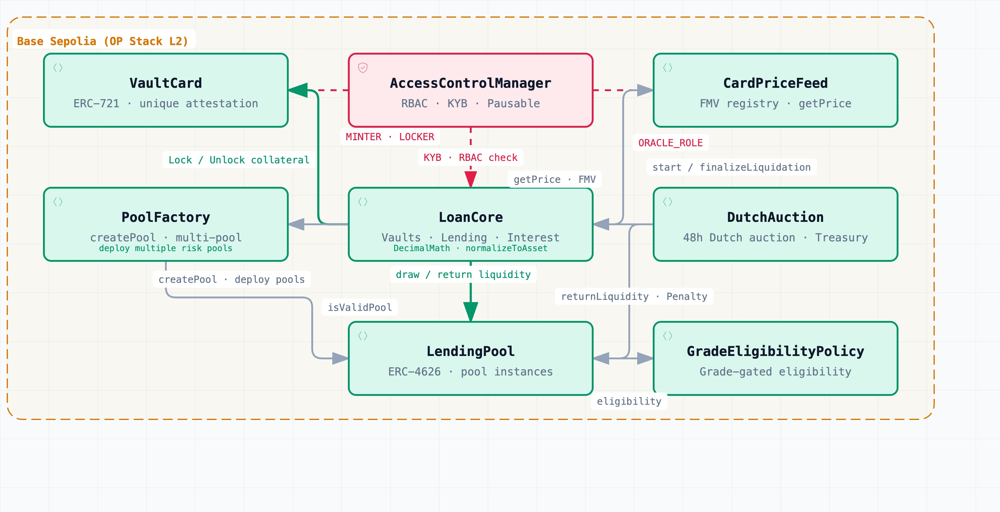

# HoloFi Protocol

[](https://soliditylang.org/)
[](https://hardhat.org/)
[](https://openzeppelin.com/contracts/)

**HoloFi Protocol** is a decentralized lending and Dutch auction liquidation protocol backed by physical Trading Card Game (TCG: Pokémon, Magic: The Gathering, Yu-Gi-Oh!) Real-World Assets (RWAs).

The protocol establishes an on-chain credit infrastructure through a four-layer architecture: **Physical Custody & Authentication + ERC-721 Asset Vouchers + ERC-4626 Multi-Asset Lending Pools + Dutch Auction Liquidation Engine**. It enables verified card merchants to unlock liquidity against their inventory without relinquishing ownership, while offering Liquidity Providers (LPs) over-collateralized, real-yield returns.

---

## Table of Contents

1. [Project Overview & Objectives](#1-project-overview--objectives)
2. [Tech Stack](#2-tech-stack)
3. [Directory Structure & Responsibilities](#3-directory-structure--responsibilities)
4. [System Architecture](#4-system-architecture)
5. [Core Smart Contract Modules](#5-core-smart-contract-modules)
6. [Configuration & Environment Variables](#6-configuration--environment-variables)
7. [Build, Test, & Deployment](#7-build-test--deployment)
8. [Documentation Index](#8-documentation-index)

---

## 1. Project Overview & Objectives

### 1.1 Market Problems
- **Illiquidity**: Converting high-value physical cards to cash takes weeks or months via traditional auctions and marketplaces.
- **Fragmented Valuation**: Card secondary market prices are scattered across offline and online venues without unified on-chain fair market value anchors.
- **Low Capital Efficiency**: Merchant inventory remains idle capital without collateralized financing avenues.
- **Trust & Verification Overhead**: Cross-border transactions lack a trust-minimized, verifiable layer for custody, grading authentication, and settlement.

### 1.2 Core Objectives & Solutions
1. **Physical Custody & On-Chain Credit Decoupling**: Certified vault partners (**Blink**) handle physical intake, grading verification, secure storage, and redemption delivery. The protocol anchors each card on-chain using a globally unique `attestationHash` and `cardTypeId`.
2. **KYB Access Control**: Borrowers must pass Know Your Business (KYB) verification, preventing anonymous default and bad-debt exploitation.
3. **ERC-4626 Isolated Lending Pools**: Standardized vaults support multiple isolated pools per underlying reserve asset. Each pool configures independent Max LTV, Liquidation Thresholds, Liquidation Penalties, Borrow Rates, and pluggable collateral eligibility policies (`ICardEligibilityPolicy`).
4. **48-Hour Dutch Auction Liquidation & Treasury Safety Net**: When a vault's Health Factor drops below 1.0, collateral undergoes a 48-hour linear Dutch auction starting at 120% FMV. Auction surplus is refunded to the borrower. If unpurchased, the Protocol Treasury buys back the collateral at pure debt value, **guaranteeing zero bad-debt loss for LPs**.

---

## 2. Tech Stack

- **Smart Contracts**: Solidity
- **Development & Orchestration**: Hardhat 3, Hardhat Ignition
- **Security & Standards Libraries**: OpenZeppelin Contracts (AccessControl, ERC-721, ERC-4626, ERC-20, ReentrancyGuard, Pausable, EnumerableSet)
- **Testing Suites**: forge-std (Foundry-style Solidity unit tests), Mocha & Chai (TypeScript integration tests)
- **Client & Blockchain Interaction**: Ethers.js
- **Runtime & Tooling**: TypeScript, Node.js (ESM), tsx
- **Target Networks**: Base (L2), Ethereum (L1)

---

## 3. Directory Structure & Responsibilities

```text
holofi_protocol/
├── contracts/                        # Core Solidity smart contracts and unit tests
│   ├── AccessControlManager.sol      # Central RBAC role registry and KYB whitelist manager
│   ├── HoloFiVaultCard.sol           # ERC-721 card voucher token with locking & attestation logic
│   ├── HoloFiCardPriceFeed.sol       # Oracle price registry indexed by cardTypeId (18 decimals USD)
│   ├── HoloFiLendingPoolFactory.sol  # Multi-asset ERC-4626 lending pool factory
│   ├── HoloFiLendingPool.sol         # ERC-4626 yield pool with pool-level risk & non-transferable shares
│   ├── HoloFiVaultLoanCore.sol       # Credit engine (vault lifecycle, borrowing, interest accrual)
│   ├── HoloFiDutchAuction.sol        # 48-hour Dutch auction liquidation and Treasury buyback engine
│   ├── interfaces/                   # Contract interfaces (ICardEligibilityPolicy.sol)
│   ├── policies/                     # Collateral eligibility filters (GradeEligibilityPolicy.sol)
│   ├── libraries/                    # Utility libraries (DecimalMath.sol for precision scaling)
│   ├── mocks/                        # Test harness contracts (MockERC20.sol, ReentrantAttacker.sol)
│   └── *.t.sol                       # Native Solidity unit tests (forge-std)
├── ignition/                         # Hardhat Ignition deployment modules
│   ├── modules/                      # Deployment pipeline modules
│   │   ├── DeployHoloFiProtocol.ts   # Core protocol contracts deployment and role wiring
│   │   ├── DeployHoloFiLendingPool.ts# Parameterized lending pool instance deployment
│   │   ├── DeployHoloFiLendingPoolWithMock.ts # Mock ERC-20, policy, and dual pool deployment
│   │   └── DeployHoloFiFullProtocol.ts       # Full protocol orchestrator for local/testnet environments
│   └── deployments/                  # Chain deployment records and address artifacts
├── scripts/                          # Operational TypeScript CLI utilities
│   ├── manage-roles.ts               # Role inspection, role grants, and KYB status updates
│   ├── mint-mock-token.ts            # Test token minting and balance checks
│   ├── view-card.ts                  # Card metadata, oracle valuation, and lock status inspection
│   └── view-vault.ts                 # Vault debt, collateral, borrow capacity, and Health Factor inspection
├── test/                             # TypeScript Mocha & Ethers integration tests
├── docs/                             # Protocol specifications, architecture docs, and deployment guides
│   ├── protocol_spec.md              # Product whitepaper and complete technical specification
│   ├── System Architecture Document.md # System architecture and decoupling specification
│   ├── Deployment Guide.md           # Step-by-step Hardhat Ignition deployment manual
│   └── holofi-protocol-contract.jpeg # Smart contract architecture diagram
├── hardhat.config.ts                 # Hardhat 3 configuration (networks, compilation profiles)
├── package.json                      # Project dependencies and script shortcuts
└── tsconfig.json                     # TypeScript configuration
```

---

## 4. System Architecture

### 4.1 Layered Architecture Overview



### 4.2 End-to-End Lifecycle & Data Flow

```text
① Physical Intake ──► Blink authenticates & vaults card ──► Computes attestationHash & cardTypeId
                                                                      │
                                                                      ▼
② On-Chain Title  ──► Minter executes mintCard on HoloFiVaultCard (ERC-721, Unlocked)
                                                                      │
                                                                      ▼
③ Vault Collateral──► Borrower creates Vault ──► Deposits NFT (LOCKER_ROLE locks token) ──► Validates Policy
                                                                      │
                                                                      ├─ Oracle sets price (CardPriceFeed)
                                                                      ▼
④ Borrow Execution──► Checks Max LTV ──► LendingPool.drawLiquidity ──► Stablecoins transferred to borrower
                                                                      │
                                                                      ├─ Linear interest accrual (accountedDt)
                                                                      ▼
⑤ Repayment/Close ──► Repays debt (interest first) ──► returnLiquidity to Pool ──► Unlocks NFT ──► Card unvaulted
                                                                      │
                                          (If card FMV drops and Health Factor < 1.0)
                                                                      ▼
⑥ Liquidation     ──► Starts 48h Dutch auction (120% FMV decaying to Total Debt + Penalty)
                               │
               ┌───────────────┴───────────────┐
               ▼                               ▼
      [Liquidator Bids]                [Auction Expires (48h)]
               │                               │
       ⑦ Market Settlement             ⑧ Treasury Buyback
       ├─ Repays debt principal & int. ├─ Treasury pays exact debt
       ├─ Penalty transferred to pool  ├─ Pool debt fully recovered
       ├─ Surplus refunded to borrower └─ Collateral unlocked to Treasury
       └─ Collateral transferred to liquidator  │
               │                               │
               └───────────────┬───────────────┘
                               ▼
                   【0% LP Principal Bad Debt】
```

---

## 5. Core Smart Contract Modules

| Contract | File Path | Core Responsibilities | Roles & Access |
|:---|:---|:---|:---|
| **Access Control Manager** | [`AccessControlManager.sol`](file:///Users/gnepud/projects/holofi/holofi_protocol/contracts/AccessControlManager.sol) | Centralized RBAC registry and KYB whitelist.<br>• `setKybStatus` / `setKybStatusBatch`: Manage merchant approval.<br>• `pauseProtocol` / `unpauseProtocol`: Emergency pause control. | `ADMIN_ROLE`<br>`KYB_MANAGER_ROLE`<br>`PAUSER_ROLE` |
| **NFT Asset Voucher** | [`HoloFiVaultCard.sol`](file:///Users/gnepud/projects/holofi/holofi_protocol/contracts/HoloFiVaultCard.sol) | Physical card ERC-721 voucher with transfer locking.<br>• `mintCard`: Mint NFT with unique `attestationHash` and `cardTypeId`.<br>• `setCardLock`: Lock/unlock collateral.<br>• `verifyAttestation`: On-chain proof verification against raw data. | `MINTER_ROLE`<br>`LOCKER_ROLE`<br>`ADMIN_ROLE` |
| **Card Price Oracle** | [`HoloFiCardPriceFeed.sol`](file:///Users/gnepud/projects/holofi/holofi_protocol/contracts/HoloFiCardPriceFeed.sol) | Fair market value registry indexed by `cardTypeId` (18-decimal USD).<br>• `setPrice` / `setPricesBatch`: Oracle price updates.<br>• `getPrice`: Query current card type valuation. | `ORACLE_ROLE` |
| **Lending Pool Factory** | [`HoloFiLendingPoolFactory.sol`](file:///Users/gnepud/projects/holofi/holofi_protocol/contracts/HoloFiLendingPoolFactory.sol) | Deploys and registers ERC-4626 pools with isolated risk profiles.<br>• `createPool`: Deploy lending pool with custom risk parameters.<br>• `isValidPool`: Global validation check for protocol pools. | `ADMIN_ROLE` |
| **ERC-4626 Lending Pool** | [`HoloFiLendingPool.sol`](file:///Users/gnepud/projects/holofi/holofi_protocol/contracts/HoloFiLendingPool.sol) | Liquidity vault managing deposits, borrows, and non-transferable `pToken` shares.<br>• `deposit` / `redeem`: LP share management.<br>• `drawLiquidity` / `returnLiquidity`: Credit liquidity routing.<br>• Includes 3-digit virtual share offset (`_decimalsOffset = 3`) against inflation attacks. | `LoanCore`<br>`DutchAuction`<br>`ADMIN_ROLE` |
| **Loan Core Engine** | [`HoloFiVaultLoanCore.sol`](file:///Users/gnepud/projects/holofi/holofi_protocol/contracts/HoloFiVaultLoanCore.sol) | Central credit and collateral vault manager.<br>• `createVault`: Open KYB-verified vault bound to a pool.<br>• `depositCollateral` / `withdrawCollateral`: Manage NFT collateral.<br>• `borrow` / `repay`: Credit execution and interest allocation.<br>• `repayAndWithdrawCollateral`: Atomic repayment and withdrawal. | `KYB Borrowers`<br>`DutchAuction`<br>`ADMIN_ROLE` |
| **Dutch Auction Engine** | [`HoloFiDutchAuction.sol`](file:///Users/gnepud/projects/holofi/holofi_protocol/contracts/HoloFiDutchAuction.sol) | 48-hour decaying liquidation engine with Treasury buyback.<br>• `startLiquidation`: Trigger auction when Health Factor < 1.0.<br>• `settleAuction`: Liquidator purchase, debt payoff, and borrower surplus refund.<br>• `treasuryBuyback`: Final fallback buyback protecting LP principal. | Permissionless<br>`Treasury` (Buyback) |
| **Eligibility Policy** | [`GradeEligibilityPolicy.sol`](file:///Users/gnepud/projects/holofi/holofi_protocol/contracts/policies/GradeEligibilityPolicy.sol) | Collateral filter by grading company (PSA, BGS) and grade score range.<br>• `isCardTypeEligible`: Query type eligibility.<br>• `setCardTypeOverride`: Manual whitelist override. | `ADMIN_ROLE`<br>`MINTER_ROLE` |
| **Math Library** | [`DecimalMath.sol`](file:///Users/gnepud/projects/holofi/holofi_protocol/contracts/libraries/DecimalMath.sol) | Precision scaling between 18-decimal USD and token decimals (e.g., 6-decimal USDC). | Stateless Library |

---

## 6. Configuration & Environment Variables

Hardhat 3 manages remote RPC endpoints and account keys via Configuration Variables and environment variables.

### 6.1 Configuration Variables (`hardhat.config.ts`)

| Variable | Description | Target Network |
|:---|:---|:---|
| `BASE_SEPOLIA_RPC_URL` | Base Sepolia testnet RPC URL | `baseSepolia` (Chain ID: `84532`) |
| `BASE_SEPOLIA_PRIVATE_KEY` | Private key for Base Sepolia deployer/admin | `baseSepolia` |
| `BASE_MAINNET_RPC_URL` | Base Mainnet RPC URL | `baseMainnet` (Chain ID: `8453`) |
| `BASE_MAINNET_PRIVATE_KEY` | Private key for Base Mainnet deployer/admin | `baseMainnet` |
| `SEPOLIA_RPC_URL` | Ethereum Sepolia testnet RPC URL | `sepolia` (Chain ID: `11155111`) |
| `SEPOLIA_PRIVATE_KEY` | Private key for Ethereum Sepolia deployer/admin | `sepolia` |

### 6.2 Setting Variables

Set variables via `hardhat keystore` or export directly into your shell environment:

```bash
# Option 1: Using Hardhat Keystore
npx hardhat keystore set BASE_SEPOLIA_RPC_URL
npx hardhat keystore set BASE_SEPOLIA_PRIVATE_KEY

# Option 2: Using Shell Environment Variables
export BASE_SEPOLIA_RPC_URL="https://sepolia.base.org"
export BASE_SEPOLIA_PRIVATE_KEY="0x..."
```

---

## 7. Build, Test, & Deployment

### 7.1 Compilation

```bash
npm run build
# or
npx hardhat build
```

### 7.2 Running Tests

The protocol uses a dual-layer test runner (Solidity unit tests + TypeScript integration tests):

```bash
# Run all tests (Solidity + TypeScript)
npm test
# or
npx hardhat test

# Run Solidity unit tests only (forge-std)
npx hardhat test solidity

# Run TypeScript integration tests only (Mocha/Ethers)
npx hardhat test mocha

# Run TypeScript typecheck
npx tsc --noEmit
```

### 7.3 Deployment via Hardhat Ignition

#### Local Development Setup (Full Protocol + Mock Token + Seed Liquidity)

```bash
# Terminal 1: Start local node
npx hardhat node

# Terminal 2: Deploy composite module
npx hardhat ignition deploy ignition/modules/DeployHoloFiFullProtocol.ts --network localhost
```

#### Testnet Deployment (Base Sepolia)

```bash
# Deploy core protocol
npx hardhat ignition deploy ignition/modules/DeployHoloFiProtocol.ts --network baseSepolia

# Deploy mock tokens, eligibility policy, and dual lending pools
npx hardhat ignition deploy ignition/modules/DeployHoloFiLendingPoolWithMock.ts --network baseSepolia
```

### 7.4 Operational CLI Scripts

Preconfigured CLI utilities in `scripts/` provide administrative and monitoring commands:

```bash
# 1. Role and KYB Whitelist Management
npm run roles -- check 0xAddress                       # Check role assignments and KYB status
npm run roles -- kyb 0xMerchantAddress true            # Approve KYB status for a merchant
npm run roles -- grant ORACLE_ROLE 0xOracleAddress     # Grant oracle price feed role

# 2. Card Metadata and Valuation Inspection
npm run view-card -- 1                                 # View Token ID 1 metadata, FMV, and lock status

# 3. Collateral Vault Inspection
npm run view-vault -- 1                                # View Vault ID 1 collateral, debt, capacity, and Health Factor

# 4. Mock Token Operations
npm run mint-mock-token -- mint 0xMerchant 10000       # Mint 10,000 mock EURC to merchant address
npm run mint-mock-token -- balance 0xMerchant          # Check token balance
```

---

## 8. Documentation Index

- 📘 [Product Whitepaper & Specification](docs/protocol_spec.md): Complete protocol specifications, mathematical formulations, and sequence flows.
- 🏛️ [System Architecture Document](docs/System%20Architecture%20Document.md): Physical custody separation and architectural design.
- 🚀 [Hardhat Ignition Deployment Guide](docs/Deployment%20Guide.md): Multi-chain deployment workflows and parameter guides.
- 📊 [Interactive Architecture Diagram](docs/system_architecture_diagram.html): Interactive visualizer of protocol contracts.
- 🔒 [Audit Reports & Security Memoranda](docs/Audit/): Pre-audit scans and invariant checklists.
