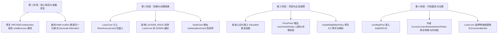

# 🛡️ HoloFi Protocol 智能合约安全审计与改进报告 (Security Audit Report)

## 1. 报告概览

- **审计目标**：HoloFi 协议核心智能合约 (`contracts/`)
- **技术框架**：Solidity `^0.8.28`, Hardhat 3, OpenZeppelin Contracts v5 (`@openzeppelin/contracts ^5.6.1`)
- **审计范围**：
  - `AccessControlManager.sol`
  - `HoloFiCardPriceFeed.sol`
  - `HoloFiVaultCard.sol`
  - `HoloFiVaultLoanCore.sol`
  - `HoloFiLendingPool.sol`
  - `HoloFiLendingPoolFactory.sol`
  - `HoloFiDutchAuction.sol`
  - `policies/GradeEligibilityPolicy.sol`
  - `interfaces/ICardEligibilityPolicy.sol`

### 风险等级统计

| 风险等级 (Severity) | 数量 | 核心影响 |
| :--- | :---: | :--- |
| 🔴 **严重 (Critical)** | **2** | 资金池份额被稀释套利、精度不匹配导致清算与借贷计算失效 |
| 🟠 **高危 (High)** | **4** | 借贷核心合约重入风险、全局缺失应急熔断、LoanCore 权限越权、实体卡 NFT 重复质押 |
| 🟡 **中危 (Medium)** | **5** | 预言机陈旧价格无心跳校验、利息微秒级截断、半级评级解析异常、裸 ERC20 操作、单步管理权单点故障 |
| 🟢 **低危与优化 (Low)** | **3** | 金库数组遍历 Gas 优化、废弃资金池下线机制、批量交易 DoS 防御 |

---

## 2. 严重风险 (Critical)

### 🔴 C-01: ERC-4626 借贷池账面资产失真 (`totalAssets` 缺失借出资产)

- **涉及合约**：`contracts/HoloFiLendingPool.sol`
- **代码位置**：`HoloFiLendingPool.sol`（第 16-150 行）
- **漏洞描述**：
  `HoloFiLendingPool` 继承自 OpenZeppelin 的 `ERC4626`。默认情况下，`ERC4626.totalAssets()` 仅返回资金池当前的代币余额：`IERC20(asset()).balanceOf(address(this))`。
  当借款人通过 `drawLiquidity` 提取流动性后，池内代币余额减少，导致 `totalAssets()` 骤降，pToken 份额的净值被大幅人为折价。
- **危害后果**：
  1. **份额稀释套利**：当池内资金被借出时，攻击者可以极低的成本存入少量代币铸造海量 pToken。
  2. **窃取 LP 收益**：当借款人还本付息后，资金池资产回升，攻击者通过赎回 pToken 即可瞬间榨取正常存款 LP 的利息甚至本金。
  3. **LP 赎回亏损**：正常存款人在有借款在外时赎回，将遭受严重的非正常折价。
- **修复方案**：
  在 `HoloFiLendingPool` 中追踪在外的借款总额 `totalBorrows`（本金 + 累计应计利息），并重写 `totalAssets()`：
  ```solidity
  uint256 public totalBorrows;

  function totalAssets() public view virtual override returns (uint256) {
      return super.totalAssets() + totalBorrows;
  }
  ```
  并在 `drawLiquidity` 时增加 `totalBorrows += amount`，在 `returnLiquidity` 时相应核减本金。

---

### 🔴 C-02: 预言机 18 位精度与代币精度不匹配 (Decimals Mismatch)

- **涉及合约**：`contracts/HoloFiCardPriceFeed.sol`, `contracts/HoloFiVaultLoanCore.sol`, `contracts/HoloFiDutchAuction.sol`
- **代码位置**：
  - `HoloFiCardPriceFeed.sol`（第 14-17 行）
  - `HoloFiVaultLoanCore.sol`（第 152-166 行, 第 319-346 行）
  - `HoloFiDutchAuction.sol`（第 97-107 行）
- **漏洞描述**：
  - `HoloFiCardPriceFeed` 规范中定义单卡价格为 18 位 USD 精度（如 $10,000 为 `10000 * 10^18`）。
  - `HoloFiVaultLoanCore.getVaultFMV` 计算得出的 `vaultFmv` 为 18 位精度。
  - 但借贷池底层代币可能是 6 位（EURC/USDC）或 8 位（WBTC）。
  - 在 `HoloFiVaultLoanCore.borrow` 中，`newTotalDebt`（6 位精度）直接与 `maxBorrow`（18 位精度）进行比较；
  - 在 `getHealthFactor` 中，`(vaultFmv * ltBps * 1e18) / (totalDebt * 10000)`，分子为 18 位，分母为 6 位，导致计算出的健康因子被放大了 $10^{12}$ 倍。已严重穿仓的借款健康度依然显示极大值，**导致系统永远无法触发清算**；
  - 在 `HoloFiDutchAuction.startAuction` 中，`startPrice` 基于 18 位 FMV 计算，而 `reservePrice` 是 6 位债务，导致荷兰拍卖在 6 位代币池中结算时会向清算人索要 $10^{12}$ 倍的代币。
- **修复方案**：
  在涉及 FMV 与代币转换的所有计算中，统一使用 OpenZeppelin `Math.mulDiv` 将 18 位 USD 估值归一化到底层代币的实际精度：
  ```solidity
  uint8 assetDecimals = IERC20Metadata(poolAsset).decimals();
  uint256 normalizedFmv = (assetDecimals <= 18) 
      ? vaultFmv / (10 ** (18 - assetDecimals)) 
      : vaultFmv * (10 ** (assetDecimals - 18));
  ```

---

## 3. 高危风险 (High)

### 🟠 H-01: 核心借贷合约缺失重入锁 (`ReentrancyGuard`)

- **涉及合约**：`contracts/HoloFiVaultLoanCore.sol`
- **代码位置**：`HoloFiVaultLoanCore.sol`（第 200-438 行）
- **漏洞描述**：
  - `HoloFiVaultLoanCore` 在 `withdrawCollateral` 和 `finalizeLiquidation` 中调用 `safeTransferFrom` 转移 ERC-721 NFT，会触发接收者的 `onERC721Received` 回调。
  - 在 `borrow` 和 `repay` 中调用外部 LendingPool 划转代币。
  - 恶意合约可在 `onERC721Received` 回调中重入调用 `withdrawCollateral`、`borrow` 或 `repayAndWithdraw`。
- **修复方案**：
  引入并继承 OpenZeppelin 的 `@openzeppelin/contracts/utils/ReentrancyGuard.sol`，为 `depositCollateral`, `withdrawCollateral`, `borrow`, `repay`, `repayAndWithdraw`, `startLiquidation`, `finalizeLiquidation` 增加 `nonReentrant` 修饰符。

---

### 🟠 H-02: 权限边界越权：`LoanCore` 被迫授予 `ADMIN_ROLE`

- **涉及合约**：`contracts/HoloFiVaultCard.sol`, `contracts/AccessControlManager.sol`
- **代码位置**：`HoloFiVaultCard.sol`（第 101-111 行）
- **漏洞描述**：
  `HoloFiVaultCard.setCardLock` 仅允许 `ADMIN_ROLE` 调用。为了让 `HoloFiVaultLoanCore` 在质押和赎回时能够锁定/解锁卡牌，系统被迫将协议全局最高的 `ADMIN_ROLE` 授予 `LoanCore` 合约，违背了最小权限原则。
- **修复方案**：
  在 `AccessControlManager` 中定义专门的 `LOCKER_ROLE`，并将 `setCardLock` 的权限放宽给 `LOCKER_ROLE` 或 `ADMIN_ROLE`，`LoanCore` 仅需被授予 `LOCKER_ROLE`。

---

### 🟠 H-03: 实体卡认证哈希未做唯一性检查（防伪双押漏洞）

- **涉及合约**：`contracts/HoloFiVaultCard.sol`
- **代码位置**：`HoloFiVaultCard.sol`（第 65-99 行）
- **漏洞描述**：
  `mintCard` 接收物理金库卡牌的 `attestationHash`，但未校验该哈希是否已被使用。若操作失误或恶意 Minter 输入同一哈希多次铸造，链上会生成多个独立 NFT 对应同一张物理实体卡，可被用来在不同金库中双重质押借款。
- **修复方案**：
  在 `HoloFiVaultCard` 中增加 `mapping(bytes32 => bool) public isAttestationUsed`：
  ```solidity
  error AttestationAlreadyUsed(bytes32 attestationHash);

  if (isAttestationUsed[attestationHash]) {
      revert AttestationAlreadyUsed(attestationHash);
  }
  isAttestationUsed[attestationHash] = true;
  ```

---

### 🟠 H-04: 协议全局缺失应急熔断暂停机制 (`Pausable`)

- **涉及合约**：`contracts/HoloFiVaultLoanCore.sol`, `contracts/HoloFiDutchAuction.sol`, `contracts/HoloFiLendingPool.sol`
- **漏洞描述**：
  `AccessControlManager` 虽然定义了 `PAUSER_ROLE`，但下游核心业务合约均未继承 `@openzeppelin/contracts/utils/Pausable.sol`。当遭遇极端预言机异常或外部物理金库风险时，协议无法暂停借贷、提款和清算。
- **修复方案**：
  在核心合约中继承 `Pausable`，并在关键外部入口加上 `whenNotPaused` 检查，由 `PAUSER_ROLE` 触发暂停。

---

## 4. 中危风险 (Medium)

### 🟡 M-01: 预言机缺少时效性心跳检测 (`Heartbeat / Staleness`) 与未上架卡归零风险

- **涉及合约**：`contracts/HoloFiCardPriceFeed.sol`, `contracts/HoloFiVaultLoanCore.sol`
- **代码位置**：`HoloFiCardPriceFeed.sol`（第 79-82 行）, `HoloFiVaultLoanCore.sol`（第 309-317 行）
- **漏洞描述**：
  1. `HoloFiCardPriceFeed` 记录了 `lastUpdated` 时间戳，但 `LoanCore` 读取价格时完全忽略了时效性，若预言机离线，协议将持续使用过期数据。
  2. 若卡牌型号未录入或价格为 0，`getPrice` 返回 0，在 `getVaultFMV` 中直接将卡估值记为 $0，可能造成借款人金库被错误判定为破产并被恶意清算。
- **修复方案**：
  在 `HoloFiCardPriceFeed` 中增加 `maxOracleDelay`（如 24 小时），读取价格时强制校验 `price > 0` 且 `block.timestamp - lastUpdated <= maxOracleDelay`。

---

### 🟡 M-02: 单利计算精度下溢导致高频微量操作逃避利息

- **涉及合约**：`contracts/HoloFiVaultLoanCore.sol`
- **代码位置**：`HoloFiVaultLoanCore.sol`（第 123-136 行）
- **漏洞描述**：
  `accrueInterest` 采用分母约 $3.15 \times 10^{11}$ 的整除计算。若借款金额较小或调用间隔极短，`interestNew == 0`，但 `vault.lastInterestUpdateTime` 依然会被更新为 `block.timestamp`，恶意用户可通过高频微操作重置时间戳逃避利息。
- **修复方案**：
  引入类似 Aave/Compound 的全局 Interest Index（累计利息指数），借款时记录快照，结算时按比例放大计算。

---

### 🟡 M-03: 评级策略对半级评分（如 "9.5"、"8.5"）解析异常

- **涉及合约**：`contracts/policies/GradeEligibilityPolicy.sol`
- **代码位置**：`GradeEligibilityPolicy.sol`（第 45-57 行）
- **漏洞描述**：
  `parseGrade` 简单提取数字拼接为整数。对于 BGS/CGC 常见的 `"9.5"` 半级评分，它会忽略小数点解析为整数 **`95`**，导致 9.5 分的卡牌被误判为 95 分，从而绕过限制。
- **修复方案**：
  将评级基准统一放大 10 倍（例如 9.5 解析为 95，10.0 解析为 100），或在解析器中显式分离整数和小数部分。

---

### 🟡 M-04: `HoloFiLendingPool` 未使用 `SafeERC20`

- **涉及合约**：`contracts/HoloFiLendingPool.sol`
- **代码位置**：`HoloFiLendingPool.sol`（第 129 行, 第 139 行）
- **漏洞描述**：
  合约中直接使用 `IERC20.transfer` 和 `IERC20.transferFrom`。对于像 USDT 这类不返回布尔值的非标 ERC-20 代币，交易会发生异常或静默失败。
- **修复方案**：
  引入 `@openzeppelin/contracts/token/ERC20/utils/SafeERC20.sol`，将转账操作全部替换为 `safeTransfer` / `safeTransferFrom`。

---

### 🟡 M-05: 单步权限转移风险，建议升级至 `AccessControlDefaultAdminRules`

- **涉及合约**：`contracts/AccessControlManager.sol`
- **代码位置**：`AccessControlManager.sol`（第 32-45 行）
- **漏洞描述**：
  目前使用的是基础 `AccessControl`，管理员权限变更一次性生效且无时间锁。若地址填错，协议最高管理权将直接永久丢失。
- **修复方案**：
  升级至 OpenZeppelin `@openzeppelin/contracts/access/extensions/AccessControlDefaultAdminRules.sol`，实现管理员两步转移（Propose -> Accept）与时间锁延迟机制。

---

## 5. 低危风险与架构优化 (Low & Optimization)

### 🟢 L-01: 金库抵押物列表使用 `EnumerableSet` 优化 Gas
- **涉及合约**：`contracts/HoloFiVaultLoanCore.sol`
- **问题描述**：`_removeTokenFromVault` 使用 $O(N)$ 的数组遍历删除元素。当单个金库质押较多卡牌时，多次赎回会有额外的 Gas 开销。
- **优化方案**：使用 OpenZeppelin `EnumerableSet.UintSet` 实现 $O(1)$ 的增删与存在性检查。

### 🟢 L-02: LendingPoolFactory 缺少废弃池注销接口
- **涉及合约**：`contracts/HoloFiLendingPoolFactory.sol`
- **优化方案**：增加 `setPoolStatus(address pool, bool isValid)` 方法，允许管理员在资金池弃用或参数迁移时将其停用。

### 🟢 L-03: 批量操作设置数组长度上限
- **涉及合约**：`AccessControlManager.sol` (`setKybStatusBatch`), `HoloFiCardPriceFeed.sol` (`setBatchPrices`)
- **优化方案**：设置 `MAX_BATCH_SIZE = 100` 限制，防止单笔交易 Gas 耗尽导致 DoS。

---

## 6. 实施路线图建议 (Action Roadmap)



### 验证标准
在完成相关安全改造后，必须执行全套编译、类型检查与测试套件验证：
```bash
npx hardhat build && npx tsc --noEmit && npx hardhat test
```
